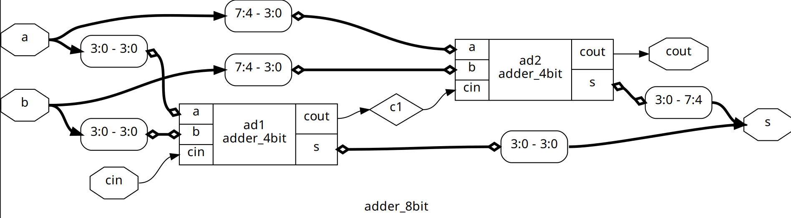
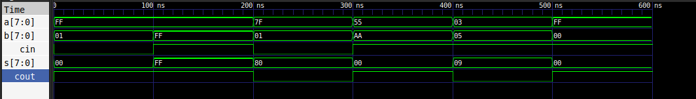
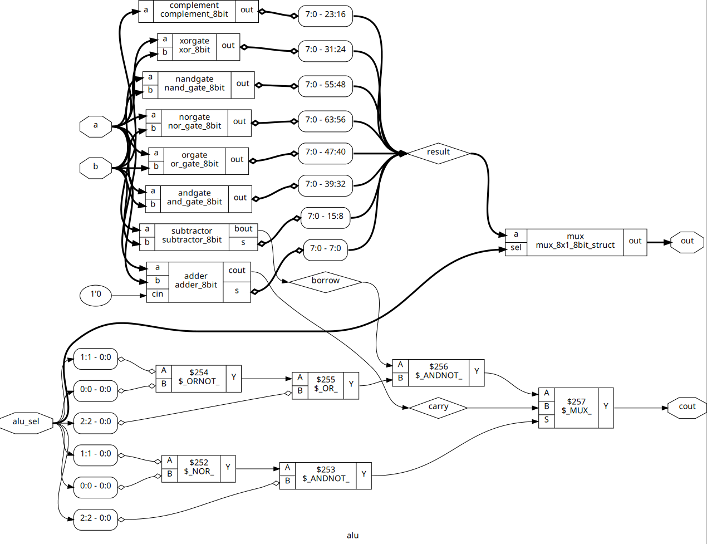
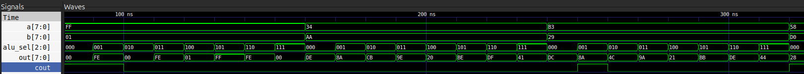

In the first lab, we learned verilog basics and implemented half adder, full adder and bit adder, by the end of which we were asked to implement a 8-bit adder and an ALU with instructions of our choosing.

### 8-bit Adder
The block diagram for my 8-bit adder is:

The timing diagram for my adder is:

### ALU
I have implemented these following operations in the 8-bit ALU:

| ALU Operation | `alu_sel` (Binary) | `alu_sel` (Hex) |   Operands   |
| ------------- | :----------------: | :-------------: | :----------: |
| ADD           |        `000`       |      `0x0`      | 2 (`a`, `b`) |
| SUBTRACT      |        `001`       |      `0x1`      | 2 (`a`, `b`) |
| COMPLEMENT    |        `010`       |      `0x2`      |    1 (`a`)   |
| XOR           |        `011`       |      `0x3`      | 2 (`a`, `b`) |
| AND           |        `100`       |      `0x4`      | 2 (`a`, `b`) |
| OR            |        `101`       |      `0x5`      | 2 (`a`, `b`) |
| NAND          |        `110`       |      `0x6`      | 2 (`a`, `b`) |
| NOR           |        `111`       |      `0x7`      | 2 (`a`, `b`) |

I have used a 8x1 mux to select select the desired operation.

The block diagram of my ALU is:

The timing diagram of ALU is:

