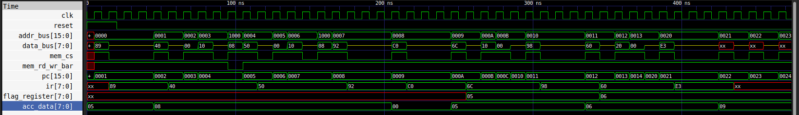

# Lab 3: Processor Verification Testbench

**Name**: Suyog Bhandari
**Roll No**: 079BCT091

## Objective

The objective of this lab is to verify the functionality of the complete 8-bit processor by integrating the processor and memory modules and executing a small program. The testbench validates arithmetic operations, memory access, conditional and unconditional branching, and flag handling while generating a waveform dump for analysis using GTKWave.

## Test Coverage

The following processor features are verified:

| Instruction | Purpose                                           |
| ----------- | ------------------------------------------------- |
| `ADD`       | Addition of register contents.                    |
| `REG2MEM`   | Store accumulator (`R0`) to memory.               |
| `MEM2REG`   | Load data from memory into `R0`.                  |
| `SUB`       | Subtraction and flag generation.                  |
| `GETFLAG`   | Copy the flag register into `R0`.                 |
| `JZ`        | Conditional jump when Zero flag is set.           |
| `NOP`       | No operation (used to verify branching behavior). |
| `INC`       | Increment accumulator.                            |
| `JMP`       | Unconditional jump.                               |
| `XOR`       | Bitwise exclusive OR operation.                   |

> [!NOTE]
> Conditional jump instructions (`JZ`, `JC`, `JNC`, etc.) do not directly inspect the flag register. Before executing a conditional jump, the flag register must be copied into the accumulator using the `GETFLAG` instruction. The jump instruction then evaluates the corresponding flag bits present in the accumulator.

## Implemented Program

The following program is loaded into memory by the testbench:

```asm
; Initial Register Values:
; R0 = 0x05
; R1 = 0x03
; R2 = 0x08
; R3 = 0x0F

0x0000: ADD     R1          ; R0 = 0x08
0x0001: REG2MEM 0x1000      ; Store R0 to memory

0x0004: MEM2REG 0x1000      ; Read memory back into R0

0x0007: SUB     R2          ; R0 = 0x00, Zero flag set
0x0008: GETFLAG             ; Copy flags to R0

0x0009: JZ      0x0010      ; Branch if Zero flag is set

0x000C: NOP                 ; Should be skipped

0x0010: INC                 ; Increment accumulator
0x0011: JMP     0x0020      ; Unconditional jump

0x0020: XOR     R3          ; Perform XOR with R3
```

## Program Execution

1. `ADD R1` adds `R1` to `R0` (`5 + 3 = 8`).
2. The result is stored at memory location `0x1000`.
3. The value at `0x1000` is read back into `R0`.
4. `SUB R2` subtracts `R2` (`8 - 8 = 0`), setting the Zero flag.
5. `GETFLAG` copies the flag register into the accumulator.
6. `JZ` detects the Zero flag and jumps to address `0x0010`.
7. The `NOP` instruction is skipped.
8. `INC` increments the accumulator.
9. `JMP` transfers execution to address `0x0020`.
10. `XOR R3` performs a bitwise XOR with `R3`.

## Compilation
```bash
iverilog -g2012 ./codes/* ../lab2/codes/* ./testbench/processor_tb.sv
```
## Generating gtkwave waveform
```bash
./a.out && gtkwave processor.vcd
```

Recommended signals for inspection:

* `clk`
* `reset`
* `addr_bus`
* `data_bus`
* `mem_cs`
* `mem_rd_wr_bar`
* `dut.pc`
* `dut.ir`
* `dut.flag_register`
* `dut.registers.register[0]`


## Result 


